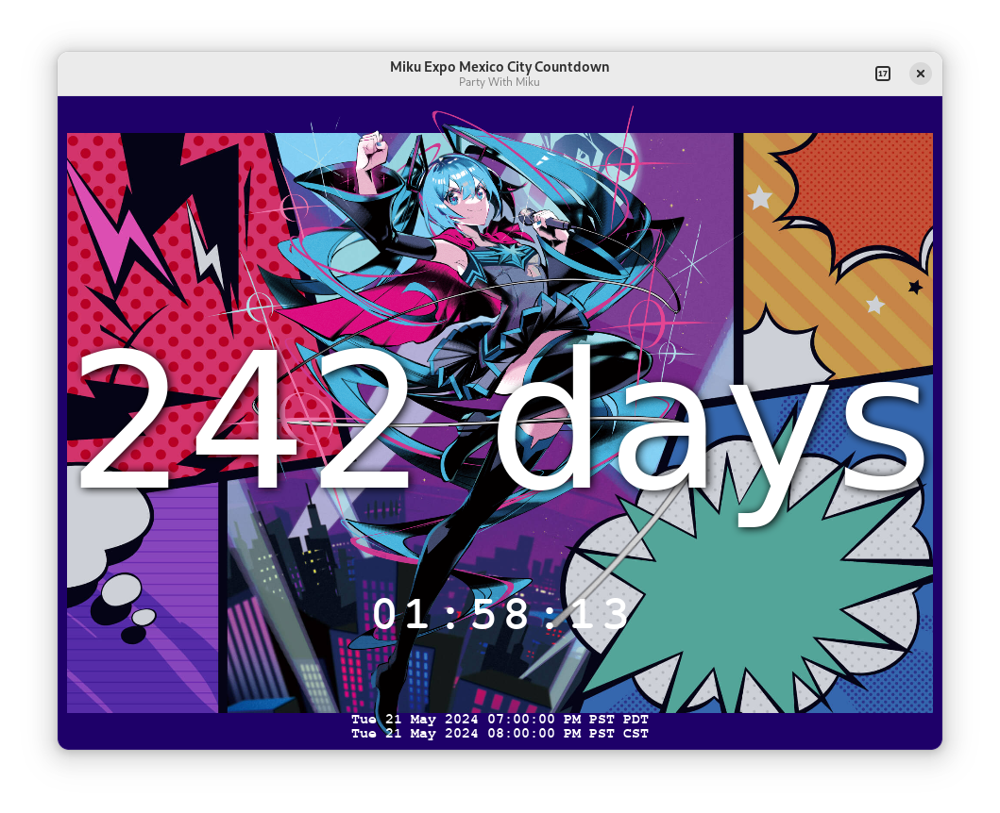

# mikuexpo-countdown



How long until Miku Expo? How long until Magical Mirai? The answer to these
questions will be at your fingertips with this toy app.

If you'd like a Flatpak, you can click this button:

<a href='https://flatpak.39music.dance/repo/stable/appstream/dance._39music.MikuExpoCountdown.flatpakref'></a>


Otherwise, to build it yourself you'll need gtkmm-4 and a C++20 compiler.

Fedora 36 instructions:
```
# sudo dnf install gtkmm4.0-devel date-devel meson gcc-c++
# meson build/
# ninja -C build
# build/src/mikuexpo-countdown # (This runs the program)

# # Optional, you can install to e.g. /usr/local
# sudo ninja -C build install
```

Other distros you can figure out yourself. The date-devel lib is optional, meson
will install the subproject if your distro doesn't have it.
